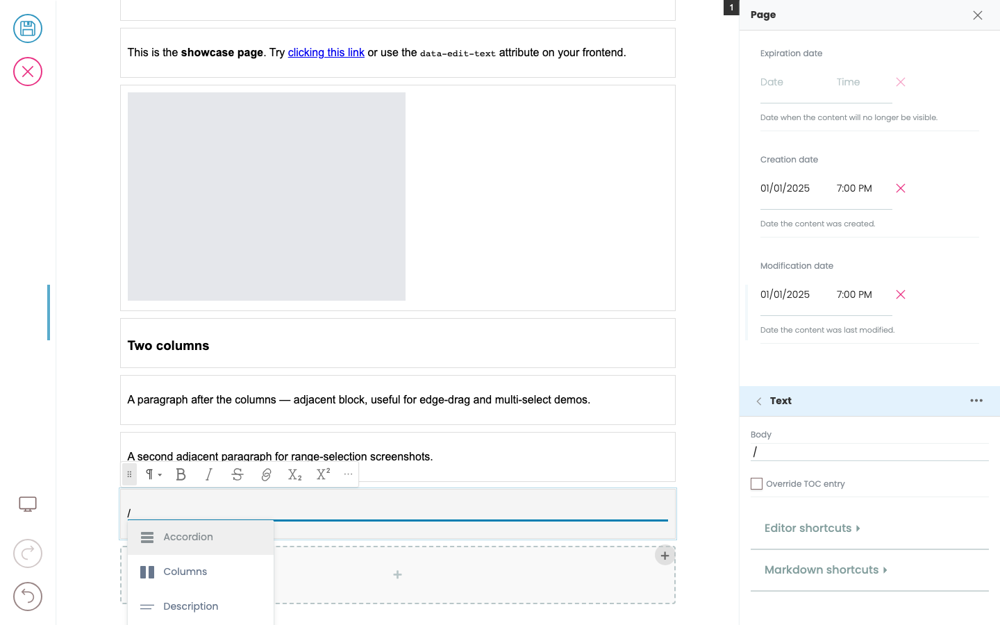

# Editing text

Click into any text in the preview that's marked inline-editable and start typing. There are two kinds of text fields: **simple text** (like a title) and **slate** (rich text — the body of a paragraph block, descriptions, etc.).

## Simple text

Click and type. `Enter` splits the field into two text blocks (when supported); `Backspace` at the start joins back. That's it.

## Slate (rich text)

Slate fields are richer:

- Select text → the Quanta toolbar shows formatting options.
- Apply marks: **Bold**, *Italic*, ~~Strikethrough~~ via toolbar buttons or keyboard shortcuts.
- Select text and click the link button to attach a URL or pick another page.
- The toolbar also surfaces paragraph-level type changes (heading, list, blockquote, etc.).

## Markdown shortcuts

When you're typing in a slate field, certain markdown patterns are converted automatically:

### Block-level (start of a line, then space)

| Type | Becomes |
|------|---------|
| `## ` | Heading 2 |
| `### ` | Heading 3 |
| `> ` | Blockquote |
| `- `, `+ `, `* ` | Bulleted list |
| `1. `, `1) ` | Numbered list |

### Inline (around selected/typed text)

| Type | Becomes |
|------|---------|
| `` `code` `` | inline code |
| `**bold**` or `__bold__` | **bold** |
| `*italic*` or `_italic_` | *italic* |
| `~~strikethrough~~` | ~~strikethrough~~ |

### Backspace-at-start: unwrap

Press `Backspace` at the very start of a heading, list item, or blockquote and it converts back to a plain paragraph. Use this when a markdown shortcut grabbed you a heading you didn't actually want.

## The slash menu

Type `/` at the start of an empty text block to open a menu of block types you can convert to (heading, image, list, your custom blocks, …). Keep typing to filter (`/he` filters to heading); `Enter` picks the highlighted result; `Escape` dismisses without changing anything.

The slash menu changes the block's `@type`. If you wanted to add a *new* block, see [Adding and moving blocks](adding-and-moving-blocks.md) instead.

## Splitting and joining paragraphs

Inside a slate paragraph block:

- `Enter` splits at the cursor — the part after the cursor becomes a new block of the same type.
- `Backspace` at the start of a block joins it with the previous block (text merges, cursor lands at the join point).

These work the same in headings and lists.

## Saving

There's no "save" inside a field — every keystroke is reflected in the page state, and changes are saved when you click the toolbar's **Save** button. Until you save, the green-dot/save indicator shows there are unsaved changes.

## Things you can't do (yet)

- Pasting rich HTML doesn't currently preserve all formatting — pasted text comes in as plain.
- A few markdown shortcuts (`#### ` for h4 etc.) aren't wired up; the supported set is the table above.
- Text-region "make this part read-only" markup isn't yet exposed to editors — frontend developers can mark whole blocks as readonly (see [Templates and layouts](templates-and-layouts.md)).
