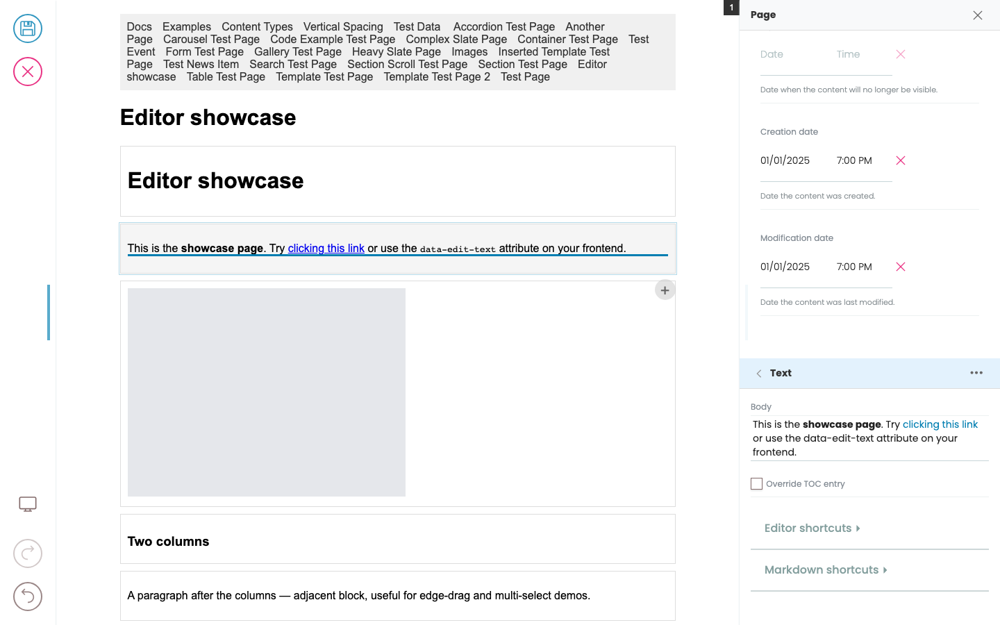
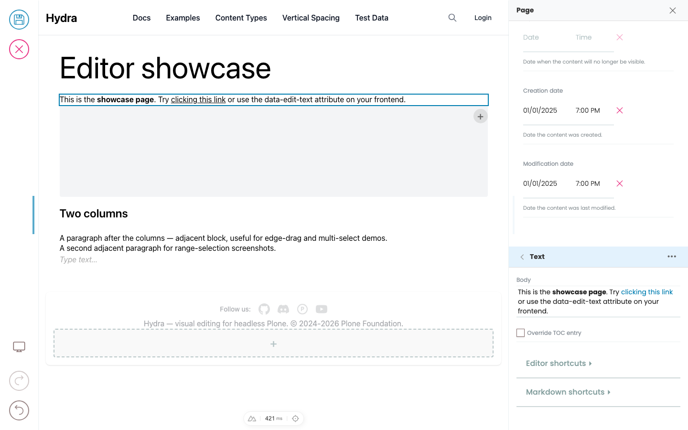
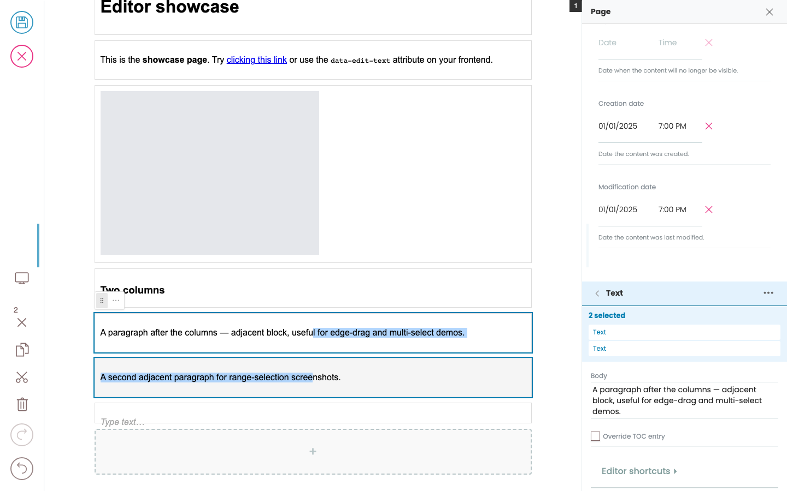

# Selecting blocks

The editor has two modes when a block is selected: **text mode** (you're editing inside the block) and **block mode** (the whole block is selected as a unit).

## Text mode

Click on a block in the preview. If the frontend marks any of its fields as inline-editable, the cursor goes into that field and you can start typing.

- A subtle border appears around the block.
- The field you're editing gets a faint underline.
- The Quanta toolbar appears above the block (formatting, convert-to, delete, etc.).
- The sidebar switches to that block's settings.



## Block mode

Press `Escape` to leave text editing. The block stays selected, but you're no longer inside any specific field.

- A full border appears around the block (visually stronger than the text-mode hint).
- Keyboard shortcuts now operate on the whole block:
  - **Arrow Up / Down** — move selection to the previous / next sibling block (container-aware: jumps into and out of containers).
  - **Enter** — add a new block after this one.
  - **Delete / Backspace** — remove the selected block.

Press `Escape` again to **deselect** (or go up to the parent container if this block is inside one). Each `Escape` walks one step up the hierarchy.



## Multi-selection

You can select multiple blocks at once and operate on the group.

| Action | Result |
|--------|--------|
| **Shift+Click** (in block mode) | Select range from currently-selected block to the clicked one |
| **Ctrl+Click / Cmd+Click** (any mode) | Toggle the clicked block in/out of the selection |
| **Shift+Arrow Up/Down** (block mode) | Extend or shrink the selection by one block |
| Plain click | Clears multi-selection, selects only the clicked block |

While multiple blocks are selected:

- A combined bounding box is drawn around them.
- `Delete` / `Backspace` removes all of them.
- The Quanta toolbar dropdown offers actions that apply to all (e.g. "Wrap in...", see [Containers](containers.md)).
- The sidebar shows the count and lists each selected block by type.



```{tip}
Shift+Click in **text mode** doesn't multi-select — that's reserved for normal text-range selection in your browser. Press `Escape` first to enter block mode, then Shift+Click.
Ctrl/Cmd+Click works in either mode.
```

## Selecting from the sidebar

The sidebar is the other way to navigate selection — useful when the block you want is offscreen, buried inside a paged container (e.g. a specific slide of a slider), or you just prefer keyboard / pointer nav over hunting in the preview.

### The parent chain (going up)

When a block is selected, the sidebar shows the **chain of parent containers** from the root down to the block — one collapsible section per level. Each level has a `‹` arrow on the left.

```text
‹ Columns          ← click ‹ to deselect (go to page level)
   [Columns settings]
   ‹ Column        ← click ‹ to select Columns
      [Column settings]
      ‹ Text       ← current block, highlighted
         [Text body, …]
```

Click any `‹` arrow to **navigate up** to that level. This does the same thing as pressing `Escape` repeatedly, but visibly — you can see what each parent is named, jump several levels in one click, and edit the parent's own settings (alignment, padding, …) inline without leaving the current selection.

This works for any depth — nested columns, slider with templated children, accordion inside a section inside the page. The chain reflects the real DOM hierarchy.

### The children list (going down)

When a container block is selected, the sidebar shows that container's **children** as a list, one row per child:

```text
Slides                    [+]
⋮⋮  Slide 1                >
⋮⋮  Slide 2                >
⋮⋮  Slide 3                >
```

- **`⋮⋮` drag handle** — drag to reorder children within the container.
- **`>` drill-in arrow** — selects that child, scrolls the preview to it, switches the sidebar to its settings.
- **`[+]` add button** — opens the BlockChooser to add a new child to that field.

If the container has multiple blocks fields (e.g. a header field and a body field), each appears as a separate section with its own children list and add button.

### Picking from the outline (for paged containers)

Some containers paginate their children — a slider only renders the active slide; an accordion only the expanded panel. Use the children list to pick a slide / panel that's not currently visible — the preview scrolls and pages to it automatically.

## Selecting page-level fields

The page itself has metadata fields (title, description, preview image). Some are inline-editable in the preview (e.g. clicking the rendered `<h1>` to edit the page title); all are editable from the sidebar when no block is selected.
