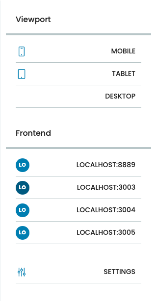
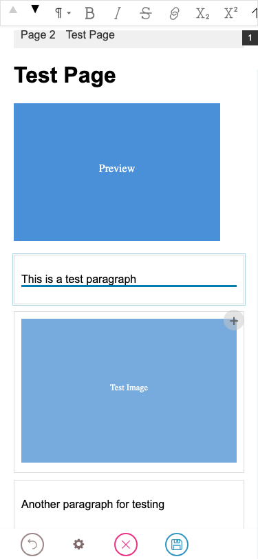
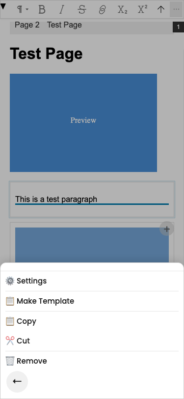
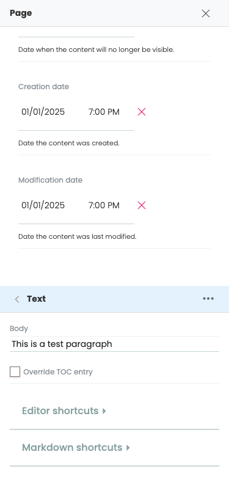
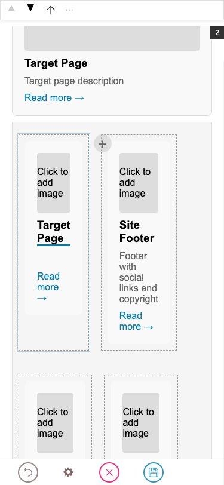

# Editor Guide

This guide is for **content editors** using a Hydra-powered site. It covers how to use the editor — how to select things, edit text, add and move blocks, work with containers and templates — without assuming you know how the site was built.

```{toctree}
:maxdepth: 1

selecting-blocks
editing-text
links-and-media
adding-and-moving-blocks
containers
templates-and-layouts
```

## Hydra mechanics vs your site's design system

Two layers are stacked on the editor screen:

- **Hydra's mechanics** — the toolbar, sidebar, selection borders, Quanta toolbar, slash menu, link picker, image picker, container operations. These look and behave the same on every Hydra-powered site, and this guide covers them.
- **Your site's design system** — what block types exist, how they render, which fields are inline-editable, the names you see in menus. The live preview comes straight from your frontend, so a "paragraph" might be called "Lead paragraph", an image block might have a caption your developers added, the slash-menu list of available block types reflects what your site registered. The mechanics are the same; only the labels and visuals change.

If something in this guide doesn't match what you see, it's almost always because your design system named or styled it differently — the underlying interaction is still the same.

## What you see

The editor screen has three regions:

```text
┌───────────┬──────────────────────────────────┬──────────────┐
│           │                                  │              │
│  Toolbar  │   Live preview (your frontend)   │   Sidebar    │
│           │                                  │              │
│  • Save   │                                  │   Page title │
│  • Pages  │  Click anywhere here to edit.    │   Block list │
│  • Site   │                                  │   Settings   │
│           │                                  │              │
└───────────┴──────────────────────────────────┴──────────────┘
```

- **Toolbar (left)** — saving, navigating to other pages, site settings. Standard Volto, plus the **Frontend switcher** (see below).
- **Live preview (centre)** — your actual frontend, running inside an iframe. This is what readers will see. Click directly into the preview to edit.
- **Sidebar (right)** — when no block is selected, lists the page-level fields (title, description, blocks). When a block is selected, shows that block's settings, the chain of parent containers, and (for container blocks) the list of children. See [Selecting blocks](selecting-blocks.md) for the navigation patterns.

### Frontend switcher

A toolbar button opens the **Frontend switcher** panel with two sections:

- **Viewport** — preview the page at common screen sizes (desktop, tablet, mobile). Pure visual switch — no content change.
- **Frontend** — list of saved frontend URLs the editor can switch between. Picking one swaps the iframe to that frontend immediately. Same content, different rendering — a Hydra-defining feature: edit a page once, see it on the marketing site, the docs site, the mobile app's web version, and the email-renderer in turn without leaving the page.

A **Settings** button at the bottom of the panel manages the saved URLs (add, remove, rename). The currently active frontend is highlighted in the list.



## Two ways to edit any field

Most fields can be edited from either side:

- **From the preview** — click the rendered text/image/link directly and start typing or replacing media.
- **From the sidebar** — find the field in the block's settings panel and edit it there.

Sidebar editing is always available. Inline editing depends on the frontend supporting it for that field; some fields show a thin underline when hovered to signal they're inline-editable. Either way the result is the same — there's only one source of truth.

## What's a block?

A block is a discrete piece of page content with a type (slate, image, listing, slider, etc.), a schema (its fields), and a position. Blocks can be added, removed, moved, and configured. Some blocks contain other blocks — those are called **container blocks** (columns, accordion, slider, grids, sections).

The page itself is a list of blocks (sometimes split across multiple regions like header / content / footer). When you click into the preview, you're clicking on a block.

## When in doubt — Escape

Pressing `Escape` is always safe. It progressively backs out:

1. If you're typing in a text field → leaves text editing, the block stays selected.
2. If a block is selected (block mode) → goes up to the parent container.
3. If nothing is selected → no-op.

So `Escape` repeatedly takes you up one level at a time. See [Selecting blocks](selecting-blocks.md) for what selection looks like at each level.

## Editing on a phone

On narrow screens (≤767 px) the editor reshapes into a two-bar layout: the **Quanta toolbar** pins to the top of the viewport — always visible, never fades — and the **main toolbar** (Save, Cancel, Frontend switcher, Settings shortcut) sits as a compact bar at the bottom. The iframe canvas fills the space in between. There is no side panel: the sidebar opens as a full-screen sheet, popups slide up from the bottom, and the link editor takes over the top bar.



### Bottom-sheet popups

The `⋯` menu — and every other contextual chooser (block-type picker, frontend switcher, convert chooser) — slides up from the bottom of the screen with the canvas dimmed behind. Tap the back arrow at the bottom-left of the sheet to dismiss; the canvas underneath comes back unchanged.



### Sidebar as a full-screen sheet

A side panel is impossible on a 375 px screen. Instead, opening the sidebar (via the **Settings** shortcut in the main toolbar, or by choosing **Settings** in the `⋯` menu) covers the entire viewport. The `X` button in the top-right closes it and brings you back to the canvas. While the sidebar is open, the iframe is hidden behind it — same source of truth, just a different surface.



### Escaping nested blocks with `⬆`

Phones don't have an `Escape` key. To walk back up out of a nested block (a teaser inside a grid, a paragraph inside a column), the Quanta toolbar shows an extra **`⬆` button** to the left of `⋯` whenever the selected block has a parent. One tap selects the parent container; tap again to keep walking up.



### Differences from desktop in one place

| Desktop / tablet | Mobile (≤767 px) |
| --- | --- |
| Quanta floats near the block, can fade after idle | Quanta pinned to top, always visible |
| Main toolbar on the left, full height | Main toolbar at the bottom, 44 px compact |
| Sidebar on the right as a side panel | Sidebar covers the whole screen |
| `⋯` menu drops down inline | `⋯` menu slides up as a bottom sheet |
| `Escape` key walks selection up | Tap the `⬆` button in Quanta |

Otherwise everything works the same: tapping a block selects it, tapping into text starts editing, the same fields and the same blocks. The mechanics are unchanged — only the placement and gestures differ.
