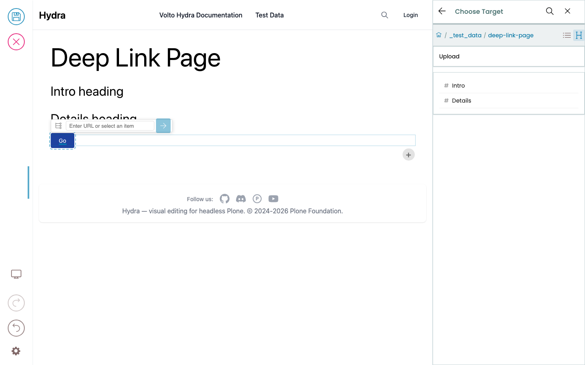
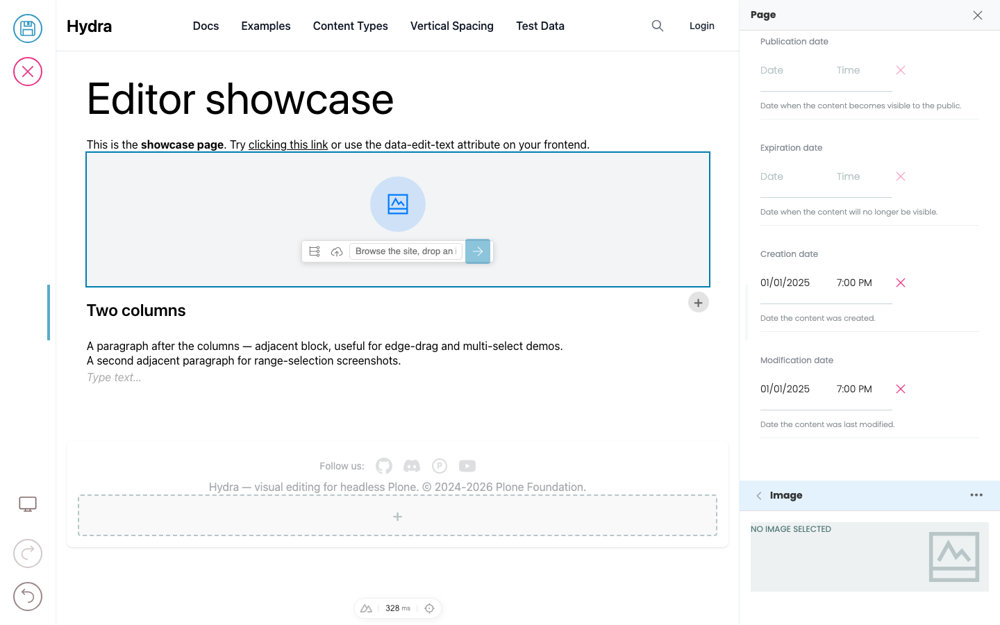

# Links and media

The link picker, image picker, and upload dialog are part of Hydra's chrome — they look the same on every site. What varies by design system is **which** links and images are click-to-edit in the preview: a site might wire up every link inline, or only a few "primary" links, with everything else editable from the sidebar. Same applies to images.

## Editing a link

When the frontend has wired up a link field as inline-editable, clicking the link in the preview doesn't navigate — it opens the **link picker** instead. From the picker you can:

- **Pick a CMS page** by browsing the content tree.
- **Type/paste an external URL.**
- **Open the URL in a new tab** (toggle the "Open in new tab" option).
- **Clear the link.**


The Quanta toolbar's link icon does the same thing and is available on slate text fields too — select some text, click the link icon, and the link picker opens for that text range.

```{tip}
The frontend can also mark certain links as **always navigable during edit mode** (paging buttons, facet controls, "next slide" arrows). Those still navigate when you click them, even in edit mode — the picker only opens for editorial links, not UI controls.
```

## Linking to a spot inside a page

Sometimes you don't want to link to the top of a page — you want to land the reader on a
particular section. Browse to the page and **open it** in the picker: if it has no pages
inside it, you'll go straight to its **Fragments** — the page's headings. Pick one and the
link becomes `/that-page#that-heading`, so the browser scrolls straight to it.

The two buttons at the top right switch between **Sub items** (pages inside this one) and
**Fragments**, so you can always get back to either.



Which spots are offered is up to the site's design system — most sites make every heading
linkable. Two things worth knowing:

- **The page you're editing is live.** Add a heading and it's immediately available as a
  target, before you save.
- **Other pages use their last saved version.** If a heading was added to another page but
  not saved yet, it won't appear until that page is saved.

## Uploading media

When the frontend marks an image (or other media element) as inline-editable, you can:

### Empty media element

You'll see an empty placeholder with a prompt to **upload, browse, or drag in** an image. Three ways:

- Click the placeholder → the media picker opens. Pick from existing CMS images or upload a new one.
- Drag an image file from your desktop and drop it directly onto the placeholder.
- Drag an image from another tab / source if your browser supports it.



### Replacing an existing media element

Hover the image — controls appear. You can:

- **Replace** — opens the media picker to pick or upload a different image.
- **Remove** — clears the field, returns to the empty placeholder state.
- **Drag and drop a new image** directly onto the existing one to replace it.

The same actions are available from the sidebar field if you'd rather not click into the preview.

## What gets stored

When you pick or upload an image, what gets stored on the block isn't a URL string — it's a small object containing the image's CMS path, the field name, and the available scales. The frontend resolves a specific scale at render time (so the same image data renders at thumbnail size in a listing and full size in a hero). You don't have to think about scales as an editor; they're a developer concern.

## What's not (yet) inline-editable

A few media types currently still require sidebar editing:

- **File uploads** (PDFs, downloads) — pickable from the sidebar but no drag-onto-preview support yet.
- **Embedded video URLs** — sidebar field; click-to-edit on the player isn't wired up.

If your frontend doesn't expose a particular media field as inline-editable, you can always edit it from the sidebar — that's available for every field.
