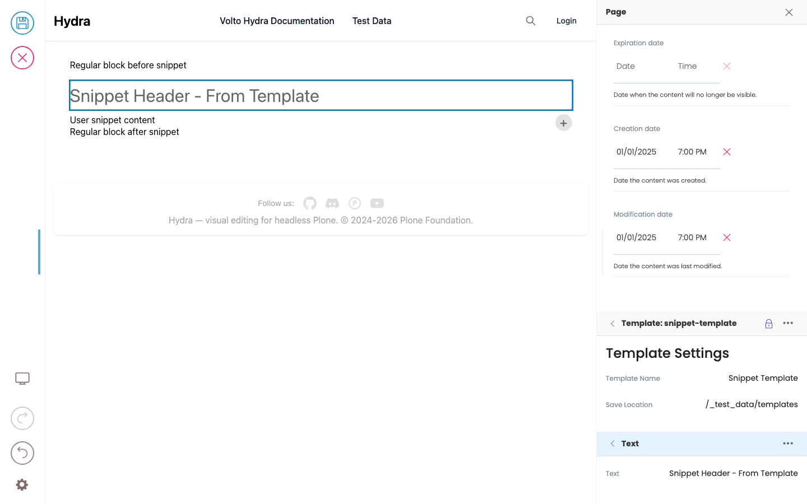

# Templates and layouts

A **template** is a piece of pre-built page structure that someone (often a developer or site admin) has saved separately. When you apply a template to a page, the page gets the template's structure overlaid: some blocks are fixed and can't be edited, some can be edited but not moved, and some are open slots where you fill in your own blocks.

Templates let editors reuse a layout consistently across many pages without copy-pasting structure each time. Two flavours:

- **Block-level templates** — a snippet you insert as a block (e.g. a "feature row" snippet you drop into the middle of a page). Configured per field as `allowedTemplates`; appears in the BlockChooser's Templates group.
- **Page-level layouts** — a full layout the whole page (or a region) is rendered through (e.g. an "article layout" with a fixed header / sidebar / footer). Configured as `allowedLayouts`; appears in the Layout dropdown.

The two share the same merge rules; the difference is just where they're applied.

```{note}
Whether your site has any templates or layouts at all is a design-system choice. A site can perfectly well skip them and let editors build pages freely; another might lock most pages into a small set of fixed layouts. The mechanics on this page apply when they're configured.
```

## What you'll see in the editor

When a template is applied to a page, blocks fall into three categories:

### 🔒 Locked (fixed + read-only)

Shown with a **lock icon** in the sidebar block list. You can't:
- Edit the text/media inside it.
- Move it (no drag handle in the Quanta toolbar).
- Delete it.

Typical use: branded headers, footers, legal disclaimers — content the template author wants identical across every page.

### Fixed (editable, not movable)

Shown without a lock but without a drag handle. You can:
- Edit text, media, links inside it.
- Change its block-level settings.

You cannot:
- Move it to a different position.
- Delete it.

Typical use: a "callout" block in the middle of a layout — every page has one, but the content varies.

### Slot (your content)

Regular blocks where you can do anything — add, edit, move, delete. The template marks regions as slots (with a `slotId`) and your existing content is placed into the matching slots when the template merges.



## Inserting between fixed blocks

You **can't** insert a new block between two adjacent fixed/readonly template blocks — the "+" button is hidden in those positions and DnD is rejected. This is intentional: the template author put those fixed blocks side-by-side on purpose, and the editor inserting between them would break the layout's intent.

If you need to add content there, you may need to switch to a different layout (one whose structure has a slot in that position) or talk to whoever maintains the templates.

## Switching the layout

When `allowedLayouts` is configured for a page (or a region), the sidebar shows a **Layout** dropdown. Pick a different layout and:

1. The new layout's structure replaces the old one.
2. Your existing content is **redistributed** into the new layout's slots based on `slotId`:
   - Content tagged with a slot name is placed into the matching slot in the new layout.
   - Content with no slot tag falls into the `"default"` slot if the new layout has one; otherwise into the bottom or top slot, or is dropped.
   - Fixed blocks with the same `slotId` get their editable content carried over (text, media); their structural settings come from the new layout.

The point of `slotId` is that two layouts can share the same set of region names — switch between them and your content lands in the right places automatically.

## Editing content inside a template

Editing inside a template block (one that came from the merged template) goes through a special **template edit mode**. While in template edit mode:

- Blocks inside the template instance become editable, including those marked readonly.
- Blocks outside the template instance become locked.

This lets you edit the template's *definition* without leaving the page — the changes propagate back to the saved template, so any other page using it picks up the change. Switch out of template edit mode (typically a toolbar action labelled "Edit template" / "Done") to go back to editing this page's content.

```{warning}
Edits made in template edit mode update the **template** itself, which may affect other pages. If you only want to override a value for this one page, look for a non-readonly version of the field on this page rather than entering template edit mode.
```

## Template instances in the sidebar

When a template is applied, the template's blocks are grouped under a single virtual entry in the sidebar block list — you'll see "Template: Article Layout" rather than each fixed/readonly block as a separate row. Expand it to see the structure inside.

## Inserting a template as a block

When `allowedTemplates` is configured on a field, the BlockChooser's Templates group shows the list. Pick one and the template's content is inserted at the current position as a block (just like adding any other block). Editor-side this is the simpler case — once inserted, the template's blocks behave the same as if a layout had placed them (lock icons, fixed-but-editable, slots).
